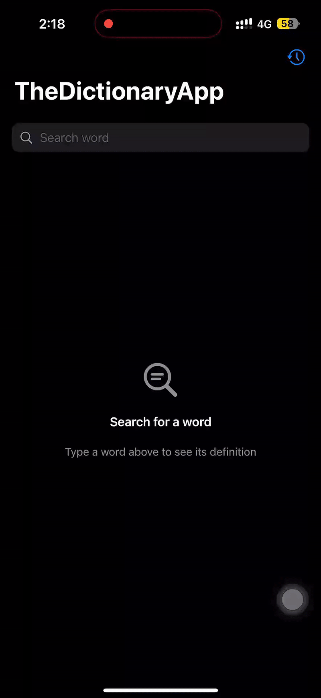

# The Dictionary App 📚

The Dictionary App is a sophisticated iOS application leveraging the Dictionary API (dictionaryapi.dev) to provide comprehensive word definitions. Built with modern Swift concurrency, Clean Architecture principles, and advanced iOS development practices, the app demonstrates enterprise-level architecture decisions, robust error handling, and efficient caching mechanisms.

## 📝 Table of Contents
- [Preview](#preview)
- [About](#about)
- [Features](#features)
- [Architecture](#architecture)
- [Technical Details](#technical-details)
- [Project Structure](#project-structure)
- [Requirements](#requirements)
- [Installation](#installation)
- [Testing](#testing)
- [Design Patterns](#design-patterns)
- [Contributing](#contributing)
- [License](#license)
- [Authors](#authors)
- [Acknowledgments](#acknowledgments)

## 📱 Preview 

## 🌟 Features 
- 🔍 Advanced word search functionality
- 🎧 Audio pronunciation with elegant UI feedback
- 💾 Offline-first architecture with CoreData persistence
- 📖 Comprehensive word details (definitions, phonetics, examples)
- 🔄 Smart caching system
- 🌐 Modern concurrent networking
- 🎨 Polished SwiftUI interface
- 📱 Responsive design across all iOS devices

## 🏗 Architecture 

The project follows Clean Architecture principles with a modular approach, divided into three main modules:

### Domain Module (Core Business Rules)
- Business entities and models
- Protocol definitions for repositories
- Use cases defining business operations
- Pure Swift with no dependencies
- Completely isolated business logic
- Thread-safe by design

### Data Module (Data & Infrastructure)
- Implementation of Domain repository protocols
- Advanced networking with modern concurrency
- Sophisticated caching with CoreData
- Custom URLSession configuration
- Comprehensive error handling
- Thread-safe logging system
- Request/Response interceptors

### Word Feature Module (Feature & Presentation)
- SwiftUI views and components
- ViewModels with Combine integration
- Feature-specific business logic
- UI state management
- Error presentation
- Navigation coordination
- Audio playback management

### Network Architecture
- Protocol-oriented design with NetworkClientProtocol
- Modern Swift concurrency with async/await
- Comprehensive request tracking system
- Advanced error handling with specific error cases
- Sophisticated logging system using os.log

### Persistence Architecture
- CoreData implementation for offline storage
- Efficient caching mechanisms
- Thread-safe operations
- Auto-cleanup strategies

## 🔧 Technical Details 

### Modern Concurrency
- Native async/await implementation
- Structured concurrency with task groups
- Actor-based thread safety
- MainActor UI updates
- Cancellation handling
- Timeout management

### Networking Features
- URLSession-based implementation
- Request ID tracking
- Comprehensive logging
- Status code mapping
- Response validation
- Custom decoder support

### Data Management
- Sophisticated caching strategy
- Offline-first approach
- Memory management
- Resource cleanup
- Migration support

### Error Handling
- Granular error types
- Network-specific errors
- Decoder errors
- Timeout handling
- User-friendly error presentation

## 📁 Project Structure 
- **Domain**: Business logic, entities, use cases
- **Data**: Networking, persistence, repositories
- **WordFeature**: UI components, ViewModels
- **App**: Main app target, DI container

## 📋 Requirements 
- iOS 17.0+
- Xcode 15.0+
- Swift 6.0
- SwiftUI 4.0

## 🔨 Installation 
1. Clone the repository:
   git clone https://github.com/mohammed-salah-zidane/TheDictionaryApp.git
2. Open TheDictionaryApp.xcodeproj
3. Build and run

## ✅ Testing 
Comprehensive test coverage including:
- Network layer unit tests
- Repository tests
- Use case tests
- ViewModel tests
- UI tests

## 📐 Design Patterns 
- Clean Architecture
- MVVM
- Repository Pattern
- Dependency Injection
- Factory Pattern
- Observer Pattern (Combine)
- Protocol-Oriented Programming

## 🤝 Contributing 
1. Fork the repository
2. Create your feature branch
3. Commit your changes
4. Push to the branch
5. Create a Pull Request

## 📝 License 
This project is licensed under the Apache-2.0 License - see the [LICENSE](LICENSE) file for details

## ✍ Authors 
- [@mohammed-salah-zidane](https://github.com/mohammed-salah-zidane)

## 🎉 Acknowledgments 
- [Dictionary API](https://dictionaryapi.dev/) for providing the word definitions
- SwiftUI and Combine frameworks
- Apple's Swift Concurrency framework
- The iOS development community

Repository: [https://github.com/mohammed-salah-zidane/TheDictionaryApp](https://github.com/mohammed-salah-zidane/TheDictionaryApp)
